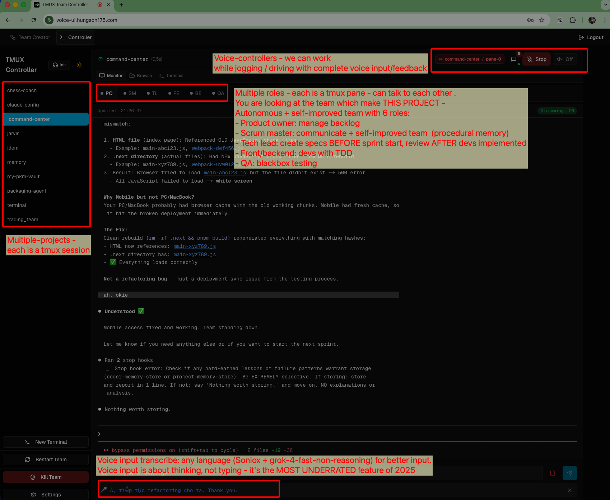
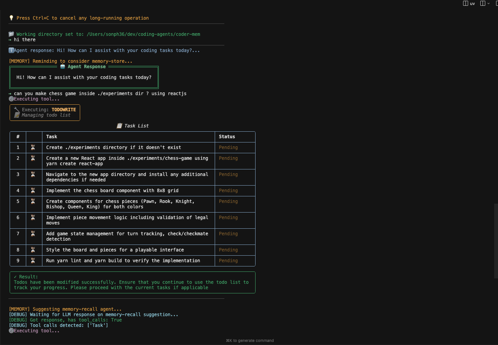

# Pham Hung Son

**Email:** sphamhung@gmail.com

---

## PROFESSIONAL SUMMARY

Software Engineer with 20+ years of experience spanning AI/ML, LLM applications, and full-stack development. Proven track record in leading R&D teams, delivering revenue-impacting solutions (20% YoY growth at Zalo), and building scalable platforms (Adtima). Currently focused on Generative AI and Large Language Models.

**Core Competencies:** LLM Applications | AI/Data Mining | Team Leadership | Python | Java | C++

---

## EXPERIENCE

### Senior Tech Lead | MoMo | 2024 - Present
- Developing LLM-powered applications: deep-research agents, multi-document reasoning, financial advisory systems, and self-improving coding agents

### Independent Projects | 2020 - 2024
- **Generative AI Researcher:** Built autonomous research system based on GPT-Researcher architecture
- **Quantitative Trading System:** Developed backtesting platform using Genetic Algorithms; achieved 15% ROI (2023)
- **Customer Support Chatbot:** Implemented Langchain + OpenAI-powered assistant for Shopify template selection
- **Investment Advisor:** Created Multi-Agent System analyzing US market sectors (2017-2021 data)

### Principal Software Engineer | VNG | 2015 - 2020
- Led R&D team developing AI/Data Mining solutions for Adtima (Zalo), driving 20% annual revenue increase
- Engineered image processing tools for Zalo PC using C++/Qt

### Mobile PM / CEO | 2010 - 2015
- **DTD Mobile Vietnam (CEO):** Managed 5-10 member team delivering Viettel Telecom projects (Qualcomm-sponsored)
- **Tosy Robotics:** Led Android client development team
- **FPT:** Delivered Nhacso 2.5 Android implementation
- **Zing:** Developed Zing MP3 Android app (pre-installed on Samsung Galaxy Y Vietnam)

---

## EDUCATION

### B.Sc. Computer Science | University of Saarland, Germany | 2005 - 2010
- Focus: Algorithms & Data Structures

### High School for Gifted Students | Vietnam | 1999 - 2005

---

## KEY ACHIEVEMENTS

- **Zalo AI 2018 Winner:** Image recognition category
- **NWERC 2006:** 8th place, outperforming Oxford and Cambridge teams
- **National Programming Contest:** 2nd prize
- **Team Development:** Mentored 3 engineers who advanced to CTO, EM, and AI R&D Manager roles
- **Vietnam Trifactor 2021:** 9th place finish

---

## TECHNICAL SKILLS

| Category | Technologies |
|----------|-------------|
| **Languages** | Python, Java, C++, JavaScript |
| **AI/ML** | LLM Applications, Langchain, OpenAI, Data Mining |
| **Frameworks** | Qt, Android SDK |
| **Methods** | Scrum, Agile, R&D Leadership |

---

## RECENT WORKS

Recently I am working on coding agents and how to make them self-improved.

### [Autonomous self-improved software team](https://github.com/hungson175/AI-teams-controller-public)
Based on Claude-Code + tmux

### [coder-mem](https://github.com/hungson175/coder-mem)
I reverse-engineered claude-code and give it memory so it can improve itself

### [Deep-Research](https://github.com/hungson175/deep-research-langchain)
I rewrite the deep-research from langgraph to langchain - I hate langgraph, and it's a good exercise

### [My blog on coding-agent memory](https://github.com/hungson175/AI-teams-controller-public/blob/master/memory-system/docs/tech/memory_guide_draft_v7.md)

---

## GitHub Stats

