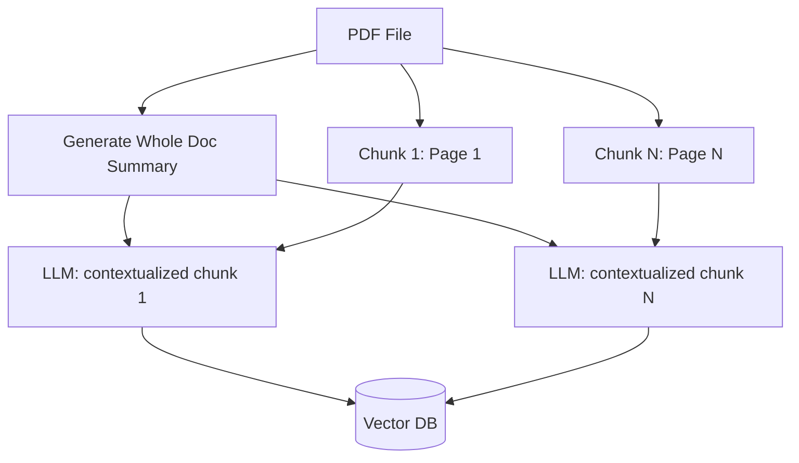
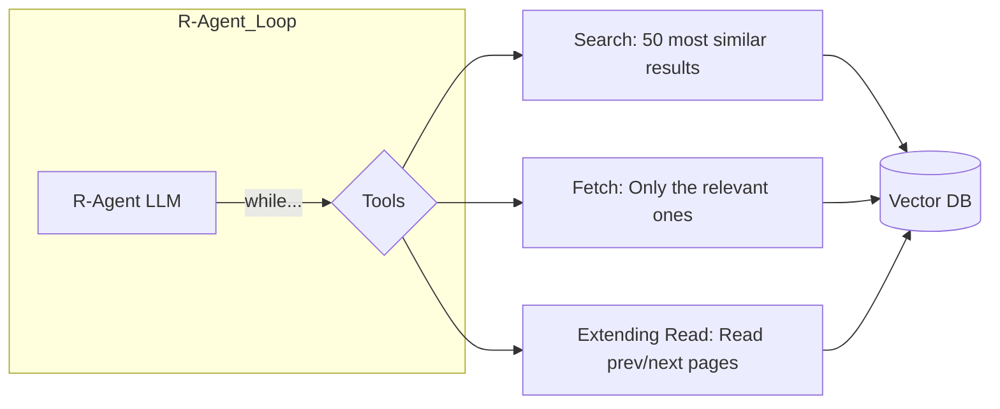

# Agentic RAG: Moving Beyond Basic Vector Search

The industry loves fancy terms like "Agentic," "Vibe Coding," and "Context Engineering." While the terminology can be exhausting, the architectural shift they describe is actually quite practical. 

Standard RAG (Retrieval-Augmented Generation) often fails because it treats retrieval as a one-shot "grab and hope" process. **Agentic RAG** fixes this by turning retrieval into an active, iterative loop.

---

## 1. The Foundation: Contextual Ingestion

Before an agent can find anything, the data needs to be indexed properly. Following the "Contextual RAG" approach (Anthropic, Sep 2024), we don't just chunk text blindly.

The problem with traditional chunking is that a single chunk (e.g., "Page 14") loses the context of the whole document. To solve this, we use an LLM during the ingestion phase to "contextualize" each chunk by prepending a summary of the entire document to it.

> **Note on Parsing:** Parsing PDF pages to Markdown is notoriously troublesome due to tables and charts. While tools like LlamaParse exist, they can be hit-or-miss. Better results often come from Vision Language models (GPT-4o, Gemini) or **Agentic Docs Extraction** (via Andrew Ng @ Landing AI).

---

## 2. Agentic Retrieval: The "Google Search" Loop

Despite the fancy name, "Agentic" retrieval is essentially a simple loop (often ~10 lines of code) that uses three specific tools: **Search**, **Fetch**, and **Extending Read**.

Think of it like using a search engine: you don't just click the first link and assume it's the whole truth. You browse, click, and read more if needed.

### The R-Agent Workflow

The **R-Agent** is a separate LLM instance. This is crucial because it keeps the "ragging" process from polluting the main LLM's context window.

- **Search:** Queries the Vector DB for the top 50–100 results, but only returns short preview text (not the full page).
    
- **Fetch:** The R-Agent looks at the previews (just like a human looking at Google results) and decides which specific chunks are worth "clicking" to get the full content.
    
- **Extending Read:** If the relevant info spans multiple pages, the LLM can decide to read the next or previous pages until it satisfies the query. This avoids the "cut-in-the-middle" problem where vector search misses surrounding context.

---

## 3. Implementation Reality Check

The original "Contextual RAG" concept (using Vector Search + BM25 + Cohere) offers excellent performance, but implementing an Agentic loop adds a layer of flexibility that is much more robust for complex documentation.

### Why this works:

- **Context Isolation:** The main LLM stays focused on the user's intent, while the R-Agent does the "dirty work" of digging through the data.
    
- **No "Cut-in-the-middle" problem:** Extending read ensures you don't lose context just because a chunk ended abruptly.
    
- **Smart Selection:** By fetching only what is necessary after a broad search, you reduce noise and improve accuracy.