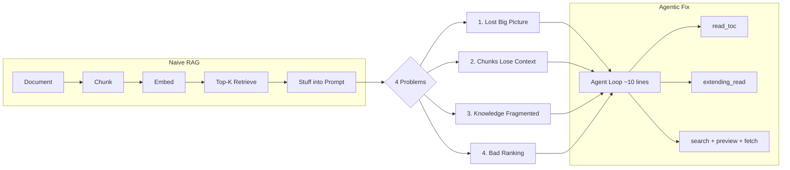

# 4 Problems of Naive RAG for Document Understanding

## Summary

Naive RAG has 4 fundamental problems:

1. **Loss of Overall Understanding** — Chunking destroys the big picture. No single chunk knows what the document is about.
2. **Contextual Isolation** — Each chunk is meaningless without its surrounding context.
3. **Knowledge Fragmentation** — A single concept may span multiple pages or cross-reference distant sections. Overlap won't save you.
4. **Ranking** — Vector similarity finds what's similar, not what's relevant.

The fix for all four: **Agentic RAG** — sounds fancy, but it's just a ~10-line agent loop with the right tools (read_toc, extending_read, search + preview + fetch). Give the LLM tools to navigate documents like a human would, and these problems disappear.

---

## 1. Loss of Overall Understanding

Chunking destroys the big picture. No single chunk knows what the document is about.

The fix: let the agent read like a human. Given a 100M-token document, it won't load everything — it checks the size (`wc`), reads the first few pages, discovers the heading structure, extracts a ToC, and summarizes each chapter. Now wrap that as a `read_toc()` tool.

If a chapter is itself too long? Same process recursively. RAG all the way down.

> Reference: The fancy name RLM - "[Recursive Language Model](https://arxiv.org/pdf/2512.24601)" - but, let be honest, the idea is simple: use the super-human coding skill of LLM - that's 

## 2. Contextual Isolation

Each chunk loses meaning when separated from its surroundings. A chunk saying "The resolution was approved unanimously" is useless without knowing which resolution, which meeting, who voted.

The fix: [Contextual RAG (Anthropic, Sep 2024)](https://www.anthropic.com/engineering/contextual-retrieval) — during ingestion, use an LLM to prepend document-level context to each chunk. One-time cost at indexing, dramatically better retrieval.

## 3. Knowledge Fragmentation

Two forms of the same problem:
- **Spanning**: A concept stretches from page 5 to page 10, but similarity search only hits page 7. You need the surrounding pages too.
- **Cross-referencing**: Page 5 references page 18 which references page 33. No chunk overlap connects them.

The fix: give your agent `extending_read(page_num)` and `read(page_num)` tools. It reads adjacent pages when context is missing, and jumps to references when needed. Exactly like a human reading a document.

## 4. Ranking

Traditional approach: use ranking engines (Cohere, Voyage, etc.) to re-score results. But no ranking model beats an LLM's judgment.

Better approach — the "mini search engine": vector search top-50, but return only 2-3 line previews (like Google search results). Let the LLM read the previews and decide which chunks to fetch in full.

The math: traditional top-5 = 5 × 4K = 20K tokens stuffed into context. Mini-search: 50 × 100 = 5K for previews, then the LLM selectively loads what matters. Better coverage, fewer tokens, smarter selection.

---

**The bigger point:** All 4 problems become surprisingly easy to solve once you give tools to a main agent loop. (~10 lines of code — the same architecture behind Claude Code, Manus, Codex.)

**Note on sub-agents:** Some operations (e.g., the mini search engine — searching 50 previews, selecting, fetching) shouldn't pollute the main agent's context window. The main agent doesn't care *how* the knowledge was found — it just wants the result. So the entire RAG retrieval can be a separate sub-agent (a separate LLM) that does the dirty work and returns only the relevant content. "Sub-agent" sounds scary — it's just using another LLM instance to keep the main context clean.

## Conclusion: Evaluation Is Everything

Agentic RAG is not fancy. It's a loop with tools. The architecture is the easy part.

The hard part is **evaluation**. Without an eval set, you're tuning blind — no way to know if your prompts, tools, or retrieval are actually improving.

**Trick to bootstrap evals cheaply:** Use a top-tier LLM (e.g., Claude Opus — $200/mo subscription, absurdly cheap) to generate your initial eval set. Feed it your documents, let it create questions, generate ground-truth answers, and define metrics. Not a replacement for human evaluation, but enough to get started.

As Andrew Ng says: you must have evaluation, but start with 2-3 examples and grow from there. Even Anthropic in their Contextual RAG paper ended up using a single simple metric: **recall**. That's it.

A note on eval frameworks: the popular "triad" approach (groundedness, context relevance, answer relevance) from Trulens and similar tools — I've tried them. Bullshit. Overcomplicated, unreliable. Pick something simple, measure what matters, and **grow your eval set with the application** — not one-shot.

---

**P.S.** If you just want something that works for a personal knowledge base (Obsidian, Markdown, second brain) — check out [qmd](https://github.com/tobi/qmd) on GitHub. BM25 + vector search + reranking, runs locally. That's all you need. Or, you can just break the project out, learn , build a new one ;)

[Best RAG article](https://x.com/nicbstme/status/2016251900249964865) I've ever read, ever !
