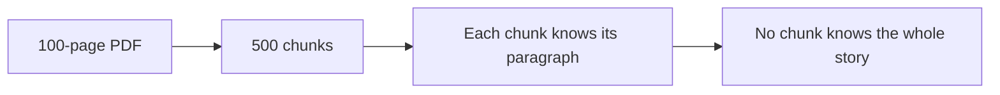
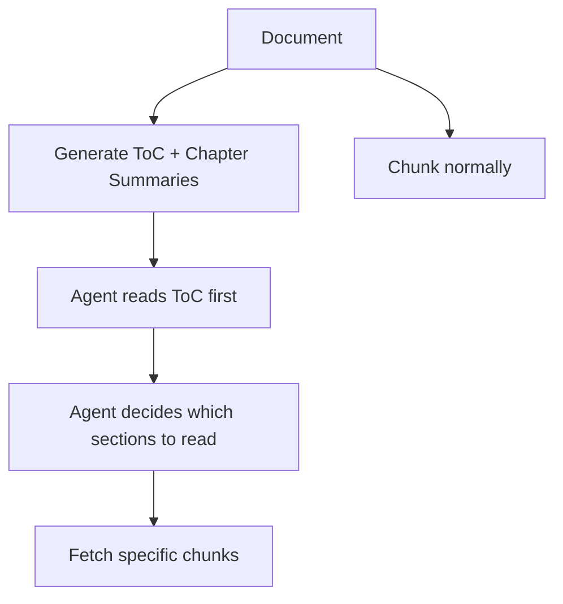
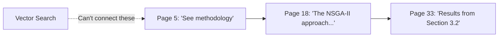
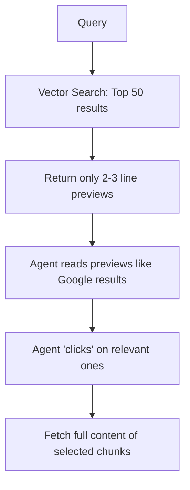

# 4 Problems of Naive RAG (And Why Agents Solve All of Them)

**2026-04-04**

---

Everyone's building RAG. Most are building it wrong.

Naive RAG — chunk documents, embed them, retrieve top-K, stuff into prompt — works for demos. It breaks in production. Here are the 4 fundamental problems, and why the fix is always the same: **give tools to an agent loop.**

---

## 1. Loss of Overall Understanding

Chunking, by nature, cuts documents into small pieces. The big picture? Gone.

Ask "What is the company's strategy for Q3?" and you'll get a chunk about Q3 revenue targets — but miss the context that the CEO opened the report by pivoting the entire business model.



**Fix:** Generate a "Table of Contents" + chapter summaries at ingestion time. Give your agent a tool to read the ToC first, then dive into specific sections. This is essentially the **PageIndex** approach (from Chinese researchers) — simple enough to build yourself.



---

## 2. Chunks Lose Context in Isolation

Take this chunk: *"The resolution was approved unanimously."*

What resolution? Which meeting? Approved by whom? The chunk is meaningless without its surrounding context.

This is what Anthropic's **Contextual RAG** paper (Sep 2024) addresses: during ingestion, use an LLM to prepend context to each chunk. Instead of storing the raw text, store:

> *"This chunk is from the Q3 Board Meeting minutes, discussing the proposal to expand into Southeast Asian markets. The resolution was approved unanimously."*

**Fix:** Contextualize chunks at ingestion time. The cost is a one-time LLM call per chunk during indexing. The payoff is dramatically better retrieval.

---

## 3. The "Cut-of-Knowledge" Problem

What if understanding one concept requires reading 4-5 consecutive chunks? No amount of chunk overlap solves this.

Worse: what if page 5 references something on page 18, which references page 33? Vector similarity won't connect these — they use completely different words to describe the same thing.



**Fix:** Give your agent an `extending_read(page_num)` tool. Let it follow the thread — read the next page, jump to a reference, read backwards. Exactly like a human reading a document.

```python
# The tool is dead simple
def extending_read(page_num: int, direction: str = "next", pages: int = 1):
    """Read adjacent pages from the document."""
    start = page_num if direction == "next" else page_num - pages
    return get_pages(start, start + pages)
```

---

## 4. Similarity ≠ Relevance

This is the sneakiest problem. Vector search finds what's **similar** to your query — not what's **relevant**.

Ask "Why did revenue drop in Q3?" and vector search returns chunks containing the words "revenue" and "Q3." But the actual answer might be in a chunk about "supply chain disruptions in Southeast Asia" that never mentions revenue at all.

**Fix #1:** Reranking (as Anthropic suggests in the Contextual RAG paper). Use a cross-encoder to re-score results for actual relevance.

**Fix #2:** The "mini search engine" approach — and this one is my favorite:



**The math:**
- Traditional top-5 retrieval: `5 × 4K tokens = 20K tokens` stuffed into context
- Mini search engine: `50 × 100 tokens = 5K for previews`, then agent loads only what matters

More coverage (50 vs 5 results), less noise, and the LLM decides what's relevant — not a similarity score.

---

## The Pattern: It's Always an Agent Loop

Here's what's interesting: all 4 fixes follow the same pattern. **Give tools to an agent and let it navigate the data like a human would.**

| Problem | Tool |
|---|---|
| Lost big picture | `read_toc()` |
| Context isolation | Contextualized chunks (ingestion-time) |
| Cut-of-knowledge | `extending_read(page, direction)` |
| Similarity ≠ relevance | `search() → preview → fetch()` |

The core architecture? A while loop with tools. About 10 lines of code — the same architecture behind Claude Code, Manus, Codex, and every powerful agent system today.

```python
messages = [system_prompt, user_query]
response = llm.invoke(messages, tools=[search, fetch, extending_read, read_toc])

while response.tool_calls:
    for call in response.tool_calls:
        result = execute(call)
        messages.append(result)
    response = llm.invoke(messages, tools=[search, fetch, extending_read, read_toc])

return response.content
```

---

## The Real Challenge

The architecture is simple. The real challenge is building a solid **evaluation set** to tune your tools against.

Without evals, you're guessing. With evals, every tool parameter — chunk size, preview length, number of search results, reranking threshold — becomes a knob you can actually turn.

Build the loop. Build the tools. Then build the evals. In that order.

---

*Previously: [How I Reverse Engineered Claude Code](reverse-claude-code-blog.md) | [Agentic RAG: Beyond Basic Vector Search](agentic_rag.md)*
