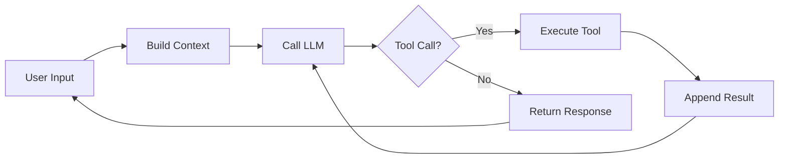
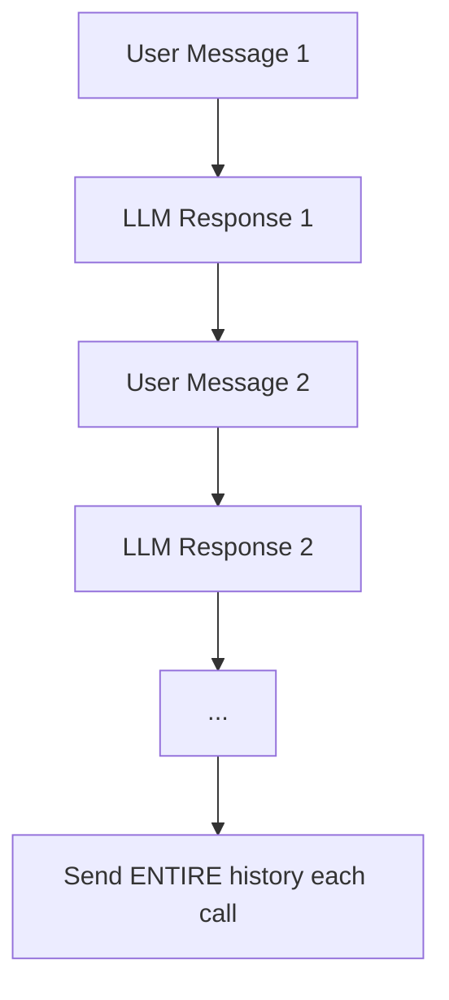
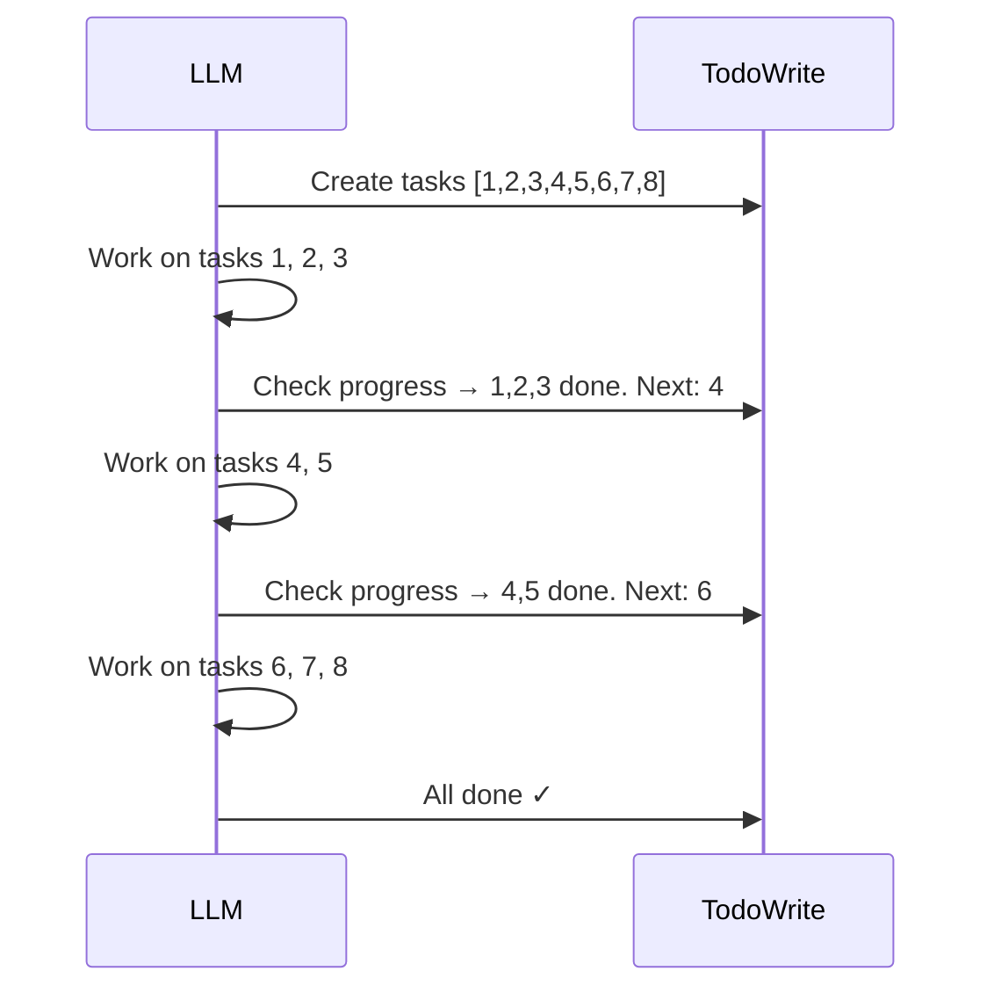
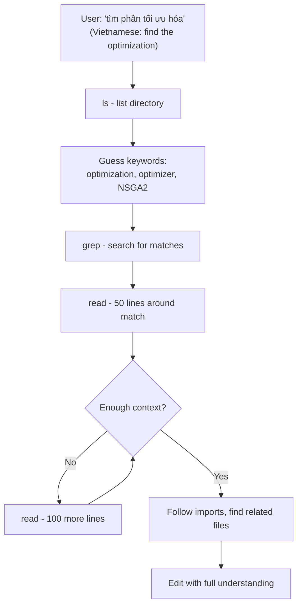
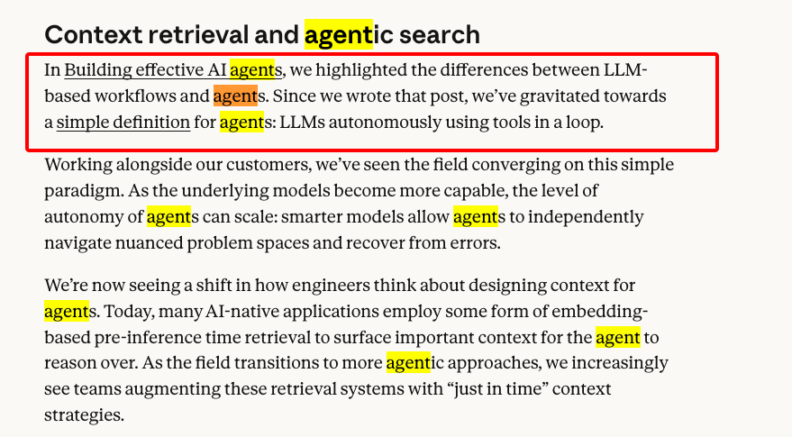

# How I Reverse Engineered Claude Code (And What I Learned)

**Draft v2 - 2026-02-01**

---

I work in AI engineering. When I switched from base Cursor to Claude Code, I was shocked — it was dramatically better. It seemed to understand entire codebases without any indexing. How?

I didn't expect I could reverse engineer the most powerful AI agent in the world. But it turned out to be surprisingly straightforward.

## How I Did It

I used [Proxyman](https://proxyman.io/) — a proxy that sits between client and server, intercepting HTTP traffic. By running Claude Code in CLI headless mode, I could see every request and response (streamed via SSE).

What I found: **nothing is hidden.** No encryption, no obfuscation. The full system prompt, all tool descriptions, and complete message history — all in plaintext.

## The Shocking Simplicity

The entire agent is a while loop. About 10 lines of code.



```
messages.append(user_input)
response = llm.invoke(messages)

while response.tool_calls:
    messages.append(response)
    for call in response.tool_calls:
        messages.append(execute(call))
    response = llm.invoke(messages)

messages.append(response)
```

The tools? Dead simple. `Bash` = OS run. `Write` = file write. `Read` = file read. Nothing worth thinking about.

Except one: TodoWrite - the planning tool

## Three Things Worth Millions

After reverse engineering the code, I realized the real value isn't in the code — it's in the **context engineering**. Three techniques stood out.

Vietnamese has the best definition I know: *"Nhét cái gì nó cần đúng lúc nó cần"* — ***stuff what it needs exactly when it needs it. That's Context Engineering*** 

### 1. Memory: Just Append




**Short-term:** No summarizing. No compression. Just append every message and response. Next call? Send the entire pile — sometimes hundreds of thousands of tokens. That's it.

**Long-term:** One file (`CLAUDE.md`). Content gets stuffed into the prompt at session start. Organize it well (progressive disclosure) and it becomes powerful persistent memory.

No vector database. No embeddings. No RAG pipeline. Just append and inject.

### 2. TodoWrite: Attention Management

The system prompt is ~3,200 tokens. The TodoWrite tool description alone takes ~800 — 1/4 for one tool out of 20. That ratio tells you everything.

LLMs are great at remembering the start and end of context. **The middle? They lose it**. TodoWrite solves this:



It's a to-do list. Break a big task into steps, periodically check "where am I?", mark progress, continue. Same thing humans do to stay focused. This is why Claude Code handles complex multi-file projects so well.

The implementation is fascinating — if you do it the "normal" software way, it doesn't work. It's a great engineering exercise. [See the code →](https://github.com/hungson175/coder-mem)

### 3. Human-Like RAG: No Indexing

Claude Code has zero pre-indexing. No vector database. Every time it needs to find something, it does exactly what a human developer would:



That's it. `ls` → guess keywords → `grep` → `read` → understand → edit. No embeddings. No chunking. No similarity search. Just Linux commands, exactly like a senior developer navigating unfamiliar code.

This is why Claude Code understands context better than Cursor or GitHub Copilot.

## It Works

I implemented all three: simple memory, TodoWrite, and human-like RAG. Built an agent with it. It works — even with Grok at $0.20 per million tokens.

Not as good as Claude Code with Opus. But it works. And that's proof the architecture really is just this.

## The Paradox

The code is worth nothing. A while loop with simple tools. Anyone can write it.

The prompts — the system prompt and tool descriptions — could be worth tens of millions. Creating them requires massive evaluation infrastructure, mountains of data, and the best AI engineers in the world. They tried thousands of approaches. The simple one won.

And Anthropic ships it all unencrypted.

**It doesn't work because it's simple. It works, and it happens to be simple.** Those are very different things.

---
# References
[Reversed claude-code repo](https://github.com/hungson175/coder-mem) 
reversed claude-code with added auto-learned memory !

[Magnus.ai article](https://manus.im/blog/Context-Engineering-for-AI-Agents-Lessons-from-Building-Manus) 
Reversing claude-code tell me HOW it works, but this article tell me WHY it works

[Anthropic's current session-memory](https://www.anthropic.com/engineering/effective-context-engineering-for-ai-agents)
It's a bit more complicated, but the old one works beautiful !

[The while-loop confession from Anthropic](https://www.anthropic.com/engineering/effective-context-engineering-for-ai-agents) 
That's how claude-code - the most powerful agent is built, don't let other lure you to fancy Agent Patterns =))s
